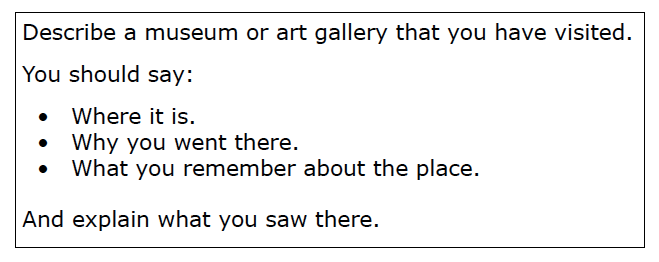

You will be allowed **60 seconds** to plan your extended answer. Test takers find that
planning a two minute talk in this short amount of time can be very challenging if you're not prepared. Many of our students have found this **mind mapping** technique useful.
          
Consider the following question card:

       
        
By mind-mapping we organize our ideas in terms of **what**, **who**, **where**, **when**, **why** and **how**.